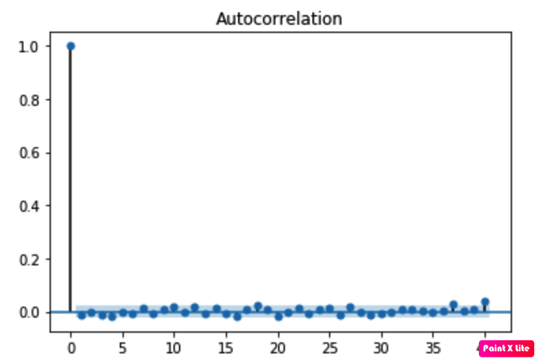
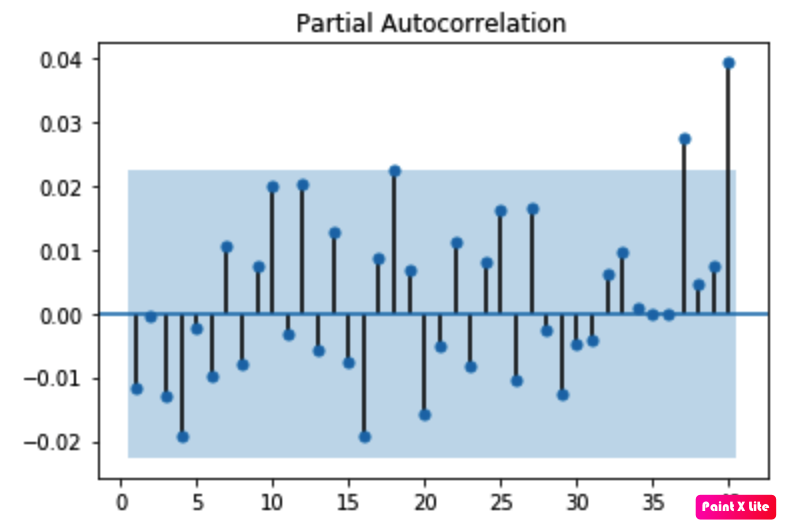
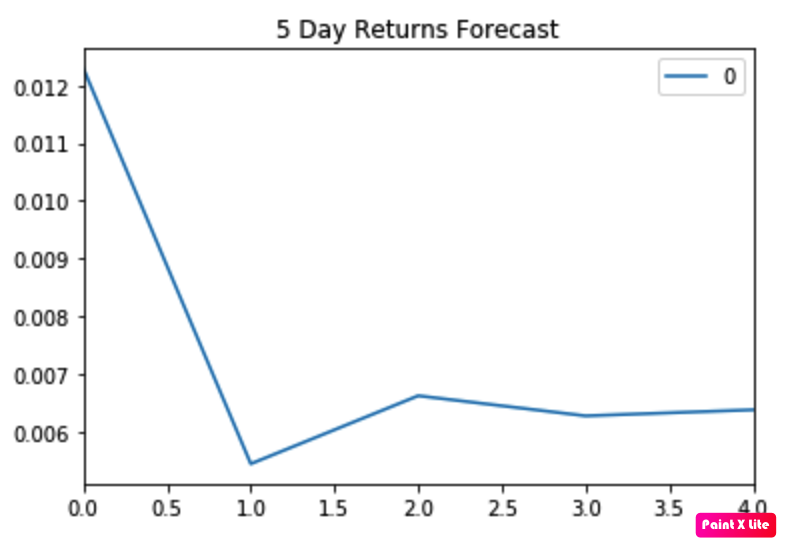
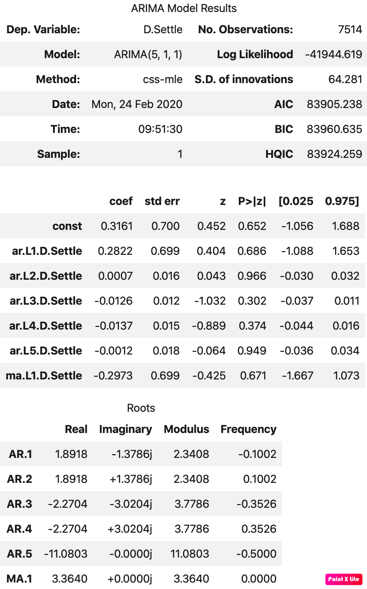
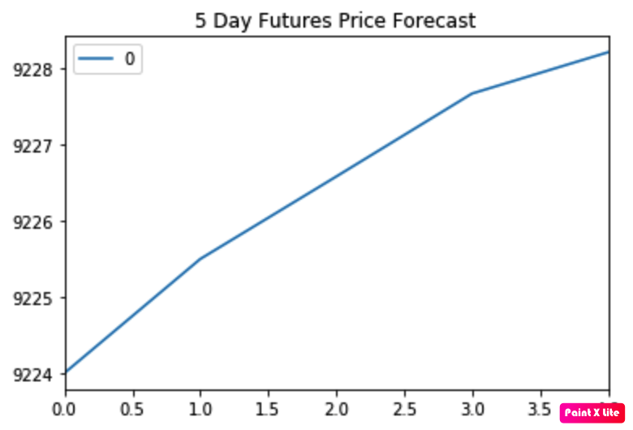
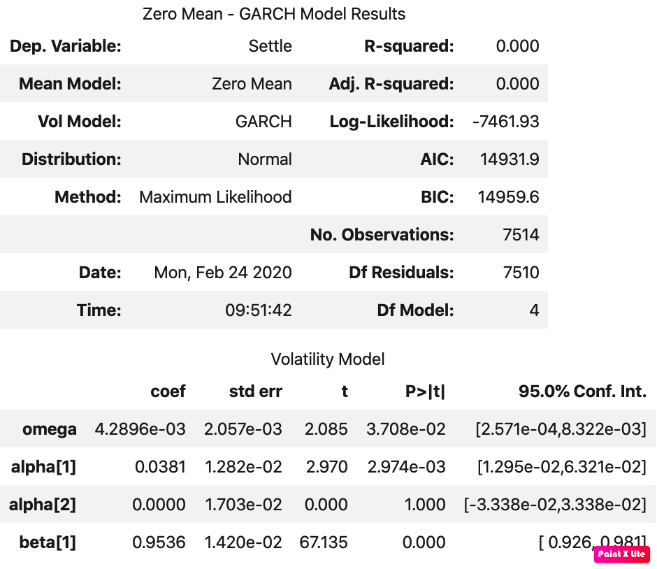
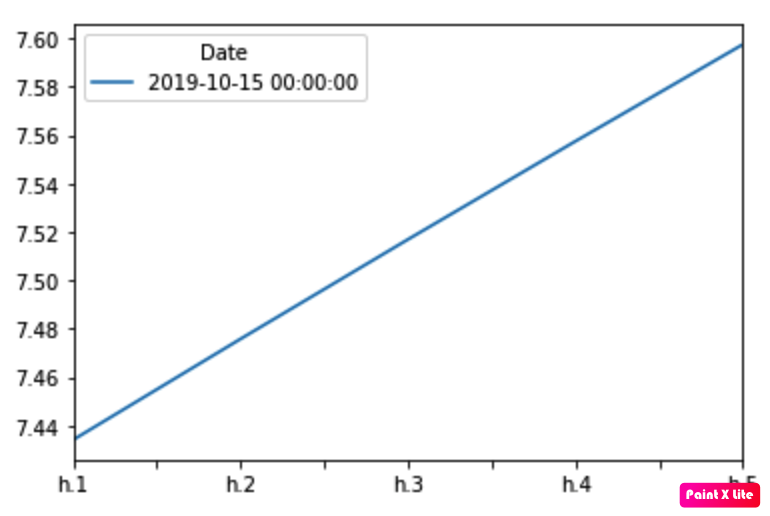
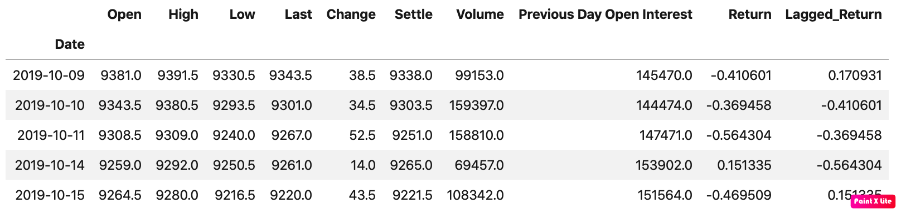
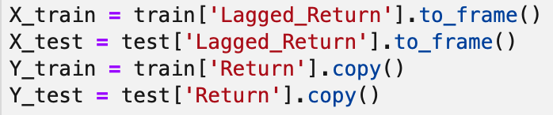
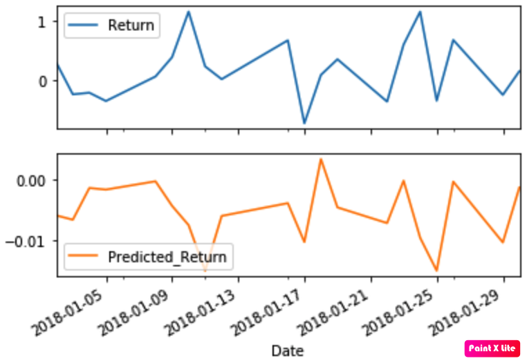

# Yen Futures - Model Fitting Analysis

During this assignment, the following models were applied to see which one is the best to predict the Yen future behaviour accordingly:

###    - ARMA
###    - ARIMA
###    - GARCH
###    - Linear Regression

### Files

[Time-Series Starter Notebook](Starter_Code/time_series_analysis.ipynb)

[Linear Regression Starter Notebook](Starter_Code/regression_analysis.ipynb)

---

## ARMA

The following DataFrame was used to run the ARMA Model Analysis:

Based on that DF, the Settle Price was Decomposed into Trend and Noise accordingly for the whole analysis:

The Autocorrelation and Partial Autocorrelation were calculated to run the ARMA Model:

After running ARMA with p=2 and q=1 Parameters, here the resuts and the 5-Days forecasting:

### Question: Based on the p-value, is the model a good fit?

### Answer: I think ARMA model is not good for this case. As seen in the results, p>|z| is always >0.05, so the model is not accurate enough!

---

## ARIMA

Based on the same DataFrame used for ARMA Model, ARIMA was executed with p=5, d=1 and q=1:

### What does the model forecast will happen to the Japanese Yen in the near term?

### Basically what the ARIMA model forecasts is that Yen will go down in the next 5 days, from 9224 to 9228 Yen/USD. In other words, in 5 days we should pay more Yen per USD than Today.

---

## GARCH

Finally with the same DF, GARCH analysis was executed:

### Conclusions

### Based on your time series analysis, would you buy the yen now?

### No!, I would SELL Yen now as all the above analysis show a bearish trend for Yen in comparison to USD.

### Is the risk of the yen expected to increase or decrease?

### According to GARCH analysis, the Yen risk is going up, from 7.44 to 7.60 in the next days.

### Based on the model evaluation, would you feel confident in using these models for trading?

### Not really, even when the above analysis shows the trends, there are not clear signs of a strong model to work with as p is not always < 0.05 in the results.

---

## Linear Regression

Starting from the following DataFrame:

Data was split in Train and Test:

### Out-of-Sample Root Mean Squared Error (RMSE): 0.41521675083603804
### In-sample Root Mean Squared Error (RMSE): 0.5658708047560468

---

## Final Conclussions

### As we can see, according to RMSE, it is better the model to predict the Returns with Test Data. It means that the model would work well predicting Returns beyond the actual data. I think this model is the most accurate one for the data we have.
