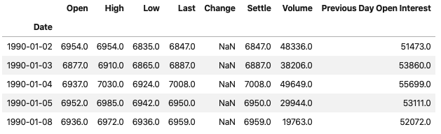
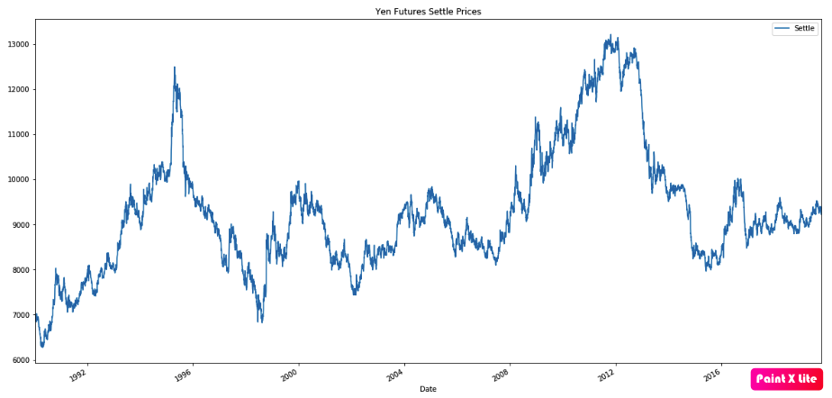
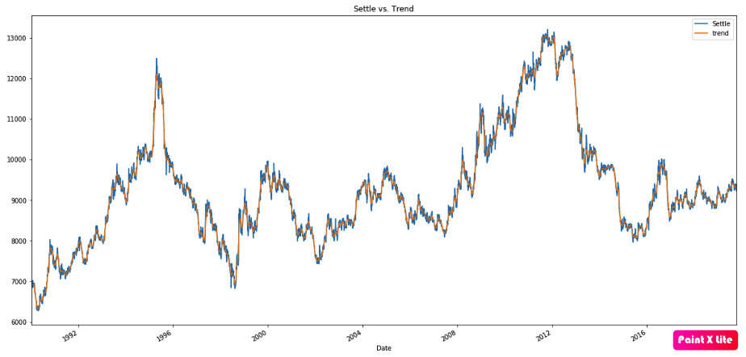
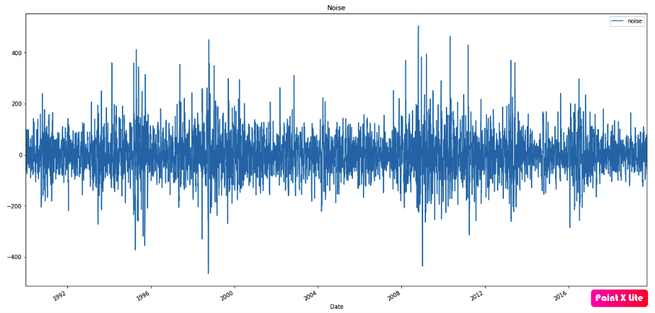

# Yen Futures - Model Fitting Analysis

During this assignment, the following models were applied to see which one is the best to predict the Yen future behaviour accordingly:

    - ARMA
    - ARIMA
    - GARCH
    - Linear Regression
---

## ARMA

The following DataFrame was used to run the ARMA Model Analysis:

According to that DF, the Settle Price was Decomposed into Trend and Noise accordingly for the whole analysis:

---

## ARIMA

---

## GARCH

---

## Linear Regression

---

## Final Conclussions
